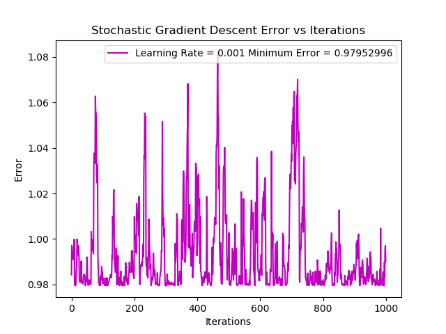
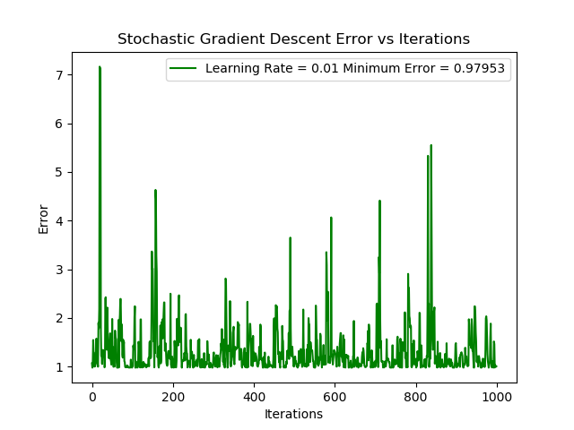
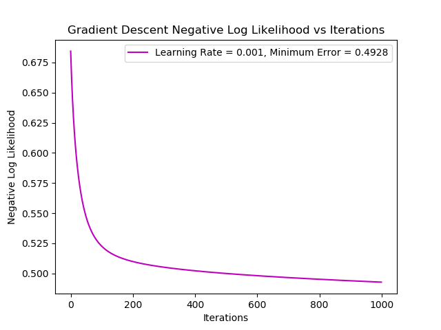
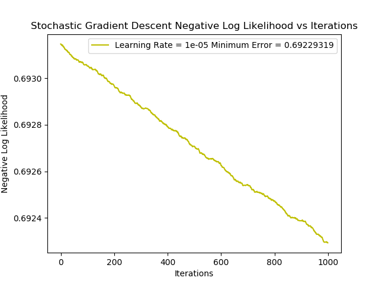
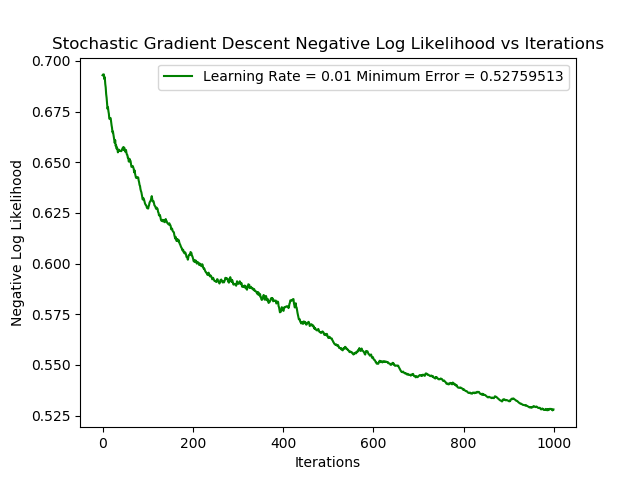
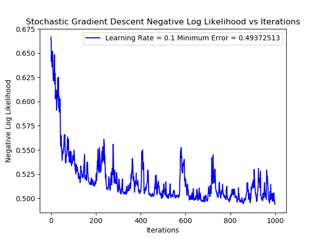

### Project Description:
This project includes a Python implementation of an MLP used to contrast gradient descent with stochastic gradient descent on two datasets. The first dataset is the "pumadyn32nm" dataset. This dataset is created using a robot arm simulator and contains 32 floating point features. The objective of the network when applied to this dataset is to estimate the angular acceleration of one of the robot arm links. The second dataset is called the "iris" flower dataset. This dataset contains just 4 floating point features and 3 classification categories pertaining to 3 different flower types. Both gradient descent and stochastic gradient descent were manually applied, without the use of PyTorch, to both datasets. The results are illustrated below.

### "pumadyn32nm" Dataset:
#### Gradient Descent:
The first 1000 training data points of the "pumadyn32nm" dataset were used. The following learning rates were explored: 0.1, 0.01, 0.001, 0.0001, 0.00001. The training error plots pertaining to each learning rate are illustrated in the Figures below:

*Figure 1: GD error plot with an LR of 0.00001 when applied to the "pumadyn32nm" dataset*

*Figure 2: GD error plot with an LR of 0.0001 when applied to the "pumadyn32nm" dataset*

*Figure 3: GD error plot with an LR of 0.001 when applied to the "pumadyn32nm" dataset*

*Figure 4: GD error plot with an LR of 0.01 when applied to the "pumadyn32nm" dataset*

*Figure 5: GD error plot with an LR of 0.1 when applied to the "pumadyn32nm" dataset*

From the Figures above, small learning rates did not allow the network to learn quick enough. Larger learning rates, however, caused rapid convergence. A considerably large learning rate of 0.1 did not cause oscillation or instability in the error plot evidenced by Figure 5. A reason for this could be that the input and output data have a trivial correlation.

#### Stochastic Gradient Descent:
For stochastic gradient descent, the following learning rates were used: 0.01, 0.001, 0.0001, 0.00001. Just as above, the error plots are illustrated below:

*Figure 6: SGD error plot with an LR of 0.00001 when applied to the "pumadyn32nm" dataset*

*Figure 7: SGD error plot with an LR of 0.0001 when applied to the "pumadyn32nm" dataset*

*Figure 8: GD error plot with an LR of 0.001 when applied to the "pumadyn32nm" dataset*

*Figure 9: GD error plot with an LR of 0.01 when applied to the "pumadyn32nm" dataset*

*Figure 10: SGD error plot with an LR of 0.1 when applied to the "pumadyn32nm" dataset*

Oscillation and instability are present in every plot. From the results above, we can conclude the stability that comes from the nature of gradient descent was necessary for the application of an MLP to the pumadyn32nm dataset.

### "iris" Dataset:
#### Gradient Descent:
Gradient descent was also applied to the "iris" dataset. The negative logarithmic likelihood plots for learning rates of 0.1, 0.01, 0.001, 0.0001, 0.00001 are delineated below:

*Figure 11: GD negative log likelihood plot with an LR of 0.00001 when applied to the "iris" dataset*

*Figure 12: GD negative log likelihood plot with an LR of 0.0001 when applied to the "iris" dataset*

*Figure 13: GD negative log likelihood plot with an LR of 0.001 when applied to the "iris" dataset*

*Figure 14: GD negative log likelihood plot with an LR of 0.01 when applied to the "iris" dataset*

*Figure 15: GD negative log likelihood plot with an LR of 0.1 when applied to the "iris" dataset*

Smooth training error plots are observed. As the learning rate increases, we see more rapid decreases in the negative log likelihood. When the learning rate reached 0.1, however, oscillation and divergence occurs.

#### Stochastic Gradient Descent:
Similarly, for the same learning rates as above, the negative logarithmic likelihood was plotted for stochastic gradient descent. These results are shown below:

*Figure 16: SGD negative log likelihood plot with an LR of 0.00001 when applied to the "iris" dataset*

*Figure 17: SGD negative log likelihood plot with an LR of 0.0001 when applied to the "iris" dataset*

*Figure 18: SGD negative log likelihood plot with an LR of 0.001 when applied to the "iris" dataset*

*Figure 19: SGD negative log likelihood plot with an LR of 0.01 when applied to the "iris" dataset*

*Figure w0: SGD negative log likelihood plot with an LR of 0.1 when applied to the "iris" dataset*

From the above, we can see that larger learning rates create more rapid convergence, but are prone to instability and oscillation. When compared to the gradient descent results, we can see that gradient descent produces more reliable results with a stronger global minimum. 

